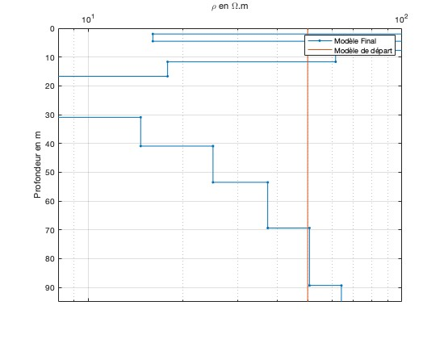

# DC_RES-1D-INV
Ce dépos a été créé pour les étudiants du stage de terrain en géophysique. Il apporte un code et des explications pour l'inversion de mesures de resistivité 1D avec la configuration Schlumberger.
## Problème inverse
Le principe du problème inverse est de simuler les données obtenues à partir d'un **modèle**, à l'aide d'un **opérateur direct**. Cet opérateur peut être une solution analytique aux équations physiques qui régissent l'expérience, ou une résolution numérique de l'équation. L'opérateur en question simule une grandeur physique (potentiel / tension , champs...) en fonction des **paramètres** de notre domaine, à savoir le sous sol. Ces **paramètres** sont dans notre cas la resistivité / conductivité et l'épaisseur des couches, mais on pourrait très bien faire une autre expérience pour déterminer d'autres paramètres physique.
Dans le cas de la resistivité 1D, le modèle que nous utilisons est une solution analytique pour un modèle de Terre constituée de couches horizontales au dessus d'un **demi espace infini**. L'opérateur a été codé par Mathias Scheunert (TUBAF). Il prend en entrée M resistivités et M-1 épaisseurs (puisque la dernière couche est infinie), et la liste des N espacements d'électrodes. Avec ces trois informations, il donne en sortie une liste de N resistivités apparentes.
La procédure d'inversion utilise ce modèle pour calculer une liste de resistivité apparente et la comparer avec celle qu'on a vraiment mesuré. Elle se base sur une solution des moindres carrés et à chaque itération calcule une direction vers laquelle les **paramètres** (resistivité, épaisseur) doivent être modifiés pour se rapprocher le mieux que possible du jeu de donnée. 
Il est aussi possible de prendre en compte les erreurs associées aux données en les multipliant par l'inverse de leur erreur associée, ce qui leur donne un poids : les points ayant les plus grosses erreurs seront moins impactants que les autres.

<p align="center" width="100%">
    
    
</p>

À gauche, en ligne continue verte figure les données modélisée par le modèle, représenté sur la figure à droite. Les données semblent convenir dans la limite des erreurs. Sur la figure à droite, la ligne orange représente le modèle de départ, qui a été choisir homogène. Cela montre que l'inversion est capable de construire un modèle qui reproduit les données à partir d'un modèle de départ relativement éloigné.

## Liste des fichiers et explication
```
dcfwdf.m           : fonction matlab calculant la réponse à un modèle de resistivité / épaisseurs 1D
Sens_log.m         : fonction matlab utilisée à chaque itération pour calculer la **sensibilité** (ou Jacobienne) et trouver une direction de modification du modèle
InversionDC1Dres.m: fonction contenant la boucle d'optimisation du modèle, faisant appel aux deux premières fonctions.
Driver_inversion.m : Code matlab à partir duquel on choisit un modèle de départ, rentre les données et lançons l'inversion.
```
## Développement du problème inverse
### Linéaration
L'équation qui décrit l'opération directe est: 
```math
\begin{equation}
\mathbf{f}(\mathbf{m}) = \mathbf{d}
\end{equation}                    
```
Le membre de gauche est l'opérateur direct, fonction du modèle. Il correpons à la fonction Matlab dcfwdf.m. Le membre de droite est bien entendu les données modélisées. 
Tout le but du problème inverse est de minimiser la différence entre les données mesurées et les données modélisées:
```math
\begin{equation}
\phi(\mathbf{m}) = \dfrac{1}{2}\lVert\mathbf{d} - \mathbf{f}(\mathbf{m})\rVert_2^2.
\end{equation}
```
Avant de directement développer l'expression de cette norme, il faut **linéariser** notre opérateur $f$. Cela vient de la nature de notre problème: l'opérateur est non linéaire car, lorsqu'on modifie légèrement notre paramètre, disons, la conductivité à un certain endroit, cela influence les données de manière non-linéaire, à plusieurs endroits en même temps, par exemple. Cela se traduit mathématiquement par la matrice Jacobienne: 
```math
 \mathbf{f}(\mathbf{m}) = \mathbf{f}(\mathbf{m_0}) + \left.\dfrac{\partial \mathbf{f}(\mathbf{m})}{\partial \mathbf{m}}\right|_{m_0}\hspace{-3mm}\Delta\mathbf{m},
```
Où la Jacobienne est le second terme : la variation des données modélisée ($\mathbf{f}(\mathbf{m})$) par rapport à la variation du modèle $\mathbf{m}$
```math
J = \dfrac{\partial \mathbf{f}(\mathbf{m})}{\partial \mathbf{m}}.
```
Cette matrice, de dimension N$\times$M est appelée matrice de sensibilité, et représente, pour chaque paramètre (j = 1,...,m) l'impact sur chaque élémenent du jeu de donnée (i= 1,..., n). Par exemple, l'élement i=1, j=1 de la matrice de sensibilité donne l'influence de la resistivité de la première couche sur la resistivité apparente. 
### Régularisation
Il nous faut ajouter une deuxième équation au problème. La norme de notre première équation correspond à ce qu'on appelle la norme des données:
```math
\phi_d = \left(\mathbf{d} - \mathbf{f}(\mathbf{m})\right)^\intercal\\\left(\mathbf{d} - \mathbf{f}(\mathbf{m})\right) = \left(\Delta\mathbf{d} - \mathbf{J}\Delta \mathbf{m}\right)^\intercal\\\left(\Delta\mathbf{d} - \mathbf{J}\Delta \mathbf{m}\right)
```
Minimiser cette norme nous permet de rapprocher nos données modélisée de nos données mesurées. Il faut ajouter une équation pour contrôler la norme du modèle, c'est la régularisation. Il existe plusieurs manière ce contrôler la norme du modèle, nous utilisons la plus simple:
```math
\lVert \alpha\hspace{2mm}\mathbf{I}\hspace{2mm}\mathbf{m} = \mathbf{0} \rVert 
```
Nous introduisons un **paramètre de régularisation ** $\alpha$. Le but à présent est de minimiser la norme à la fois des données, et du modèle, c'est le principe de discordance. Notre fonction objectif peut se réécrire 
```math
\phi =\phi_d + \alpha^2 \phi_m = \left(\Delta\mathbf{d} - \mathbf{J}\Delta \mathbf{m}\right)^\intercal\\\left(\Delta\mathbf{d} - \mathbf{J}\Delta \mathbf{m}\right) + \alpha^2 \mathbf{m}^\intercal\\\mathbf{m}\hspace{1mm}\mathbf{I}
```
Avant de continuer, un développement de Taylor de la fonction objectif donne:
```math
\phi(\mathbf{m}+\mathbf{\Delta m}) = \phi(\mathbf{m_0}) + (\nabla_{\mathbf{m_0}}\phi(\mathbf{m_0}))\Delta\mathbf{m} + \dfrac{\Delta\mathbf{m^2}}{2} + (\nabla^2_{\mathbf{m_0}}\phi(\mathbf{m_0)}) + \mathcal{O}
```
Si l'on prend le gradient de cette fonction, et en négligeant les termes d'ordres supérieurs à 2:
```math
\nabla_{\mathbf{m}}^2\phi(\mathbf{m})\Delta\mathbf{m} = -\nabla_{\mathbf{m}}\phi(\mathbf{m})
```
En injectant le resultat de nos calculs, on obtient l'équation qui va gouverner notre inversion:
```math
\left[\mathbf{J}^\intercal\\\mathbf{J} + \alpha^2\mathbf{I}\right.]\Delta\mathbf{m} =\mathbf{J}^\intercal\\\Delta \mathbf{d} 
```
## Algorithme d'inversion
Cette dernière équation nous permet de calculer $\Delta\mathbf{m}$ en se basant sur la sensibilité $\mathbf{J}$ et ainsi d'améliorer notre modèle. Un algorithme simple prend la forme:
```
choisir un modèle de départ m0
m = m0
tant que fonction objectif < seuil (par exemple)
   calculer f(m) =d
   comparer d et d_mesuree
   calculer J
   calculer $\Delta x$
   m = m + $\Delta x$
   calculer f(m) =d
   comparer d et d_mesuree
fin
```
La boucle continue tant qu'une condition de fin de boucle que l'on aura choisie n'est pas satisfaite. Ainsi, à chaque itération, on trouve une direction $\Delta x$ vers laquelle notre modèle est amélioré.

## Transformation et recherche linéaire

Il y a deux choses à ajouter :
```
Premièrement, notre paramètre est transformé en logarithme pour éviter d'avoir des resistivités négatives. Lorsque la sensibilité est calculée, et losque m est mis à jour on utilise la transformation log, et dès qu'on veut calculer les données à partir de l'opérateur on prend l'exponentiel du log.
Deuxièmement, un algorithme de recherche linéaire a été ajouté dans le cas ou le modèle irait dans la mauvaise direction. Le principe est de rajouter un coefficient à $\Delta x$ pour s'assurer qu'il décroisse de la bonne quantité et dans la bonne direction.
```
## Conseils d'utilisation

Le dossier à télécharger contient les 4 fichiers présentés plus haut. Il suffit de rentrer les données sur Matlab et de choisir un modèle de départ. Dans le fichier fourni, le modèle de départ est un modèle de resistivité homogène. Pour l'épaisseur des couches, il est conseillé d'utiliser des épaisseurs croissantes en logspace pour que la sensibilité puisse accomoder les paramètres, surtout dans les premier mètres.
